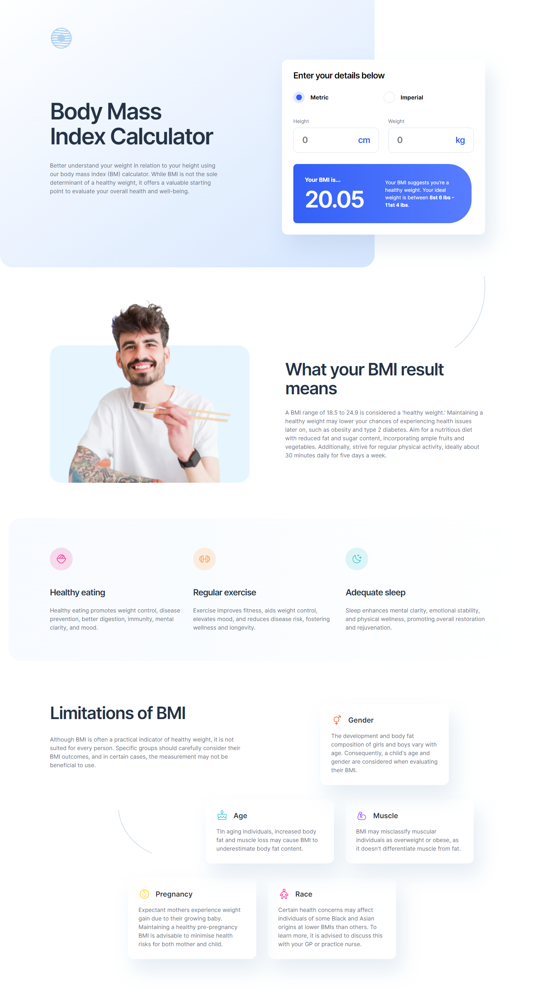
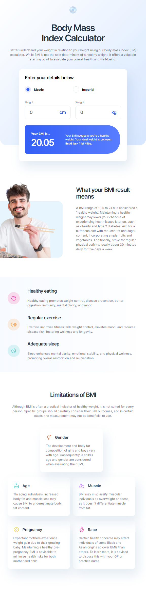
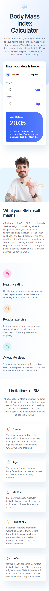

# BMI Calculator

A website that calculates your body mass index according to the metric and imperial system

## Screenshot

<b>Desktop Design</b>

  

<b>Tablet Design</b>

  

<b>Mobile Design</b>

  

## Live Demo

[Check out the live demo here:](https://bmi-calculator-focuscode.vercel.app)

## Project Summary

- BMI calculation according to metric and imperial system
- Finding one's healthy target weight (metric and imperial)
- Fully responsive design
